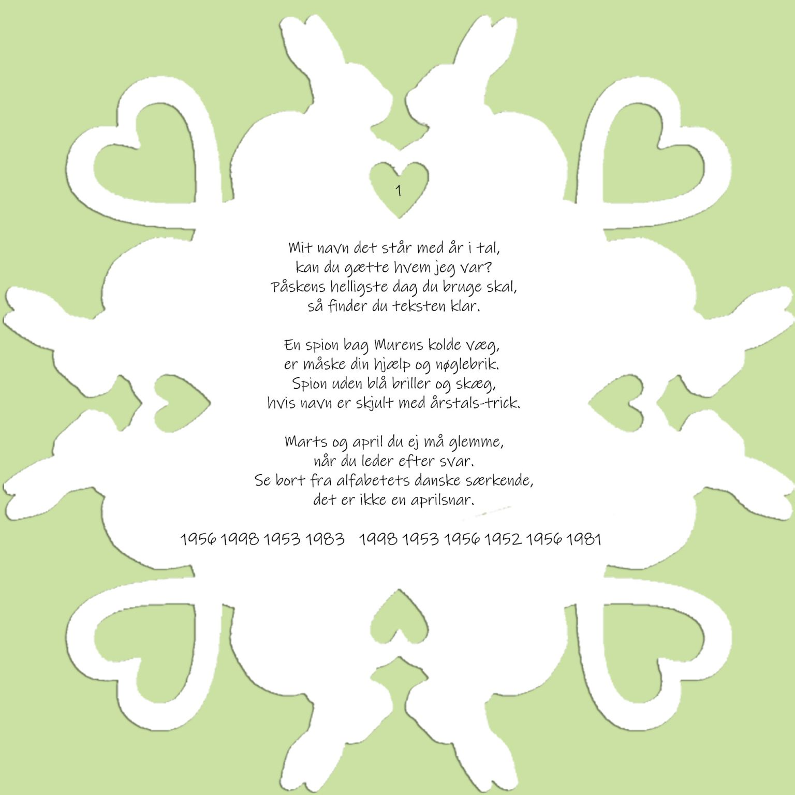
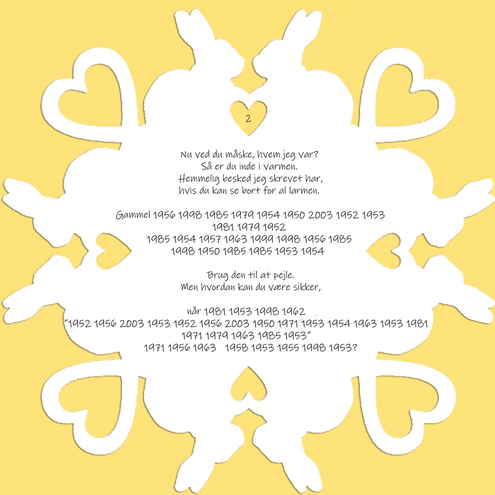
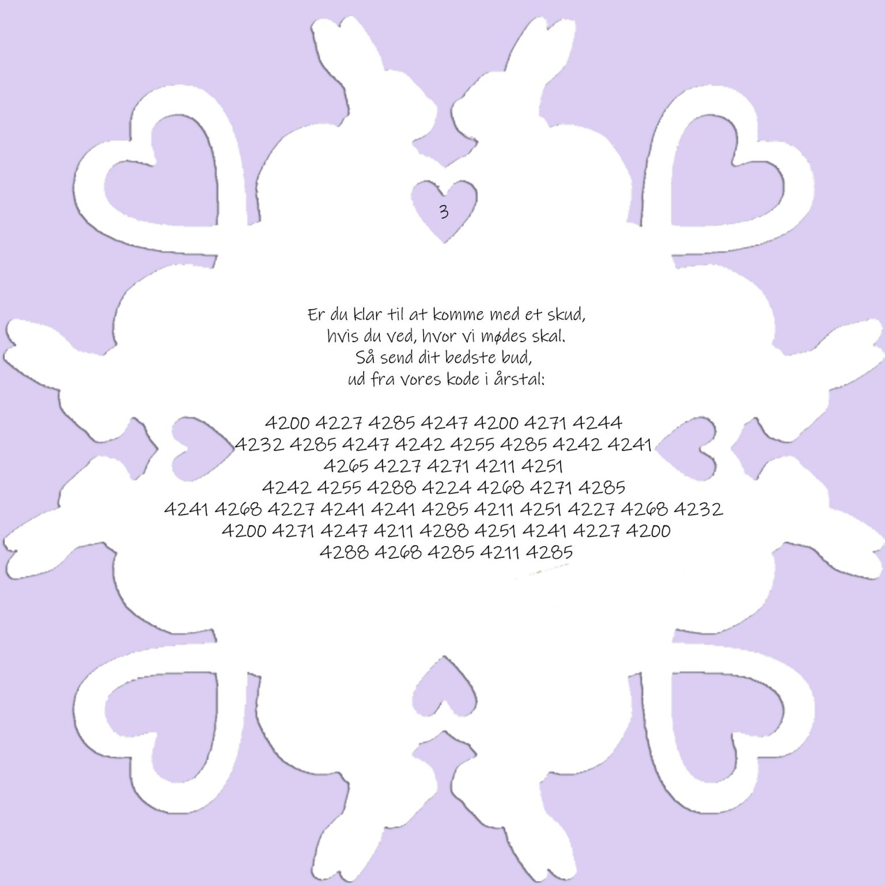

# FE-paaske-challenge-2025
[Link til challenge på FE's Linkedin](https://www.linkedin.com/posts/forsvarets-efterretningstjeneste_g%C3%A6t-g%C3%A6kkebrevets-hemmeligheder-og-vind-activity-7315681576565047298-m8GX)

# Writeup
#### Af Emil 'Dota' Bak
## Brev #1

Svaret er `ALEC LEAMAS`.

Ved at se på hvilken dato påskesøndag fandt sted på det givende årstal, kan et bogstav udledes ud fra dets placering i alfabetet.
I 1956 faldt påskesøndag d.1 April  =  1 = 'A'
I 1998 faldt påskesøndag d.12 April = 12 = 'L'
etc.

At finde frem til hvilken dato påskesøndag faldt på for et givent år kan bådes slås op online i dedikerede "easter calculators", ellers kan det selv programmeres (se [solution.py](solution.py))

Alec Leamas er hovedrollen i "The Spy Who Came in from the Cold", som også vagt hintes i brevet, hvilke blot bekræfter resultatet.

 
## Brev #2:

Svaret her er:
`Gammel ALGORITME SOM GRUNDLAG LIGGER`
`når SELV "MATEMATIKERNESKONGE" KAN FEJLE?`

Fremgangsmetoden er den samme som i **brev 1**, i.e. 1956 = 1 april = 'A' og så fremledes.
Matematikernes konge refererer til [Gauss](https://en.wikipedia.org/wiki/Carl_Friedrich_Gauss), hvilket giver mening når vi ser på **brev 3**.

## Brev #3:

Svaret er:
`moed mig ved checkpoint charlie klokken tolv midnat kom alene`

Denne gang har vi nogle fremtidige datoer i modsætning til de tidligere breve. Hvis den samme metode der blev benyttet i de tidligere breve, bruges til at udlede bogstaver, så vil resultatet være volapyk. Der skal således mere til for at udlede hemmeligheden i **brev 3**.

Ved at benytte hintet fra **brev 2** med Gauss, så vides det at Gauss har lavet en algoritme til at beregne hvornår påsken falder. Denne algoritme ([Gauss's Easter algorithm](https://en.wikipedia.org/wiki/Date_of_Easter#Gauss's_Easter_algorithm)) lavede Gauss en fejl i dens første version fra 1800. I 1816 blev denne fejl rettet (af en af Gauss studerende), og denne 1816 version er således den mest kendte/benyttede version af algoritmen.

Det andet hint fra **brev 2** påpeger at "selv Gauss kan fejle". Således hvis man benytter 1800 versionen af algoritmen vil man opnå nogle "forkerte" fremtidige påskedatoer, men datoer som dog kan bruges til at udlede en klar tekst, efter samme princip som **brev 1+2**.

Da ingen offentlig tilgængelig "easter-calculator" fandtes med den indbyggede 1800-fejl i sig, var løsningen at programere den selv. Se [solution.py](solution.py)

## Yderligere info
* Til at udlede teksten fra brevene *(fremfor at afskrive i hånden, jeg er doven af natur)*, benyttede jeg [https://www.imagetotext.info/](https://www.imagetotext.info/).
* [solution.py](solution.py)'s version af Gauss påske algoritme er selv-implementeret 1:1 efter algoritmen, som den står beskrevet på wikipedia: [https://en.wikipedia.org/wiki/Date_of_Easter#Gauss's_Easter_algorithm](https://en.wikipedia.org/wiki/Date_of_Easter#Gauss's_Easter_algorithm)